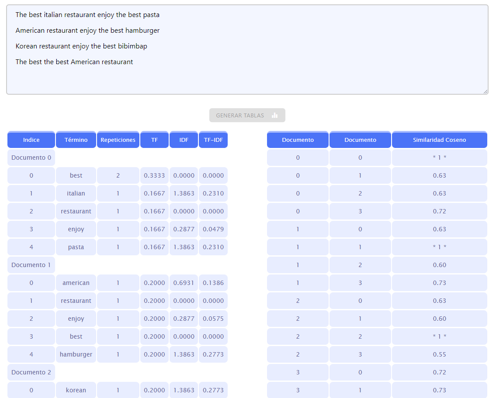

# GESTIÓN DEL CONOCIMIENTO EN LAS ORGANIZACIONES
## Sistemas de recomendación - Modelos Basados en el Contenido
#### José Daniel Fuentes Marra - alu0101166247@ull.edu.es

### **[Link para probar la web online](https://alu0101166247.github.io/GCO-SR-Modelos-Basados-en-el-Contenido/)**

Este proyecto está desarrollado en Javascript y HTML, en el index.html se encuentra el código en html de la página web donde se puede interactuar con el proyecto:

El primer paso es pinchar donde dice seleccionar archivo y buscar el .txt que queramos evaluar, una vez hecho esto se habilitara el boton Generar Tablas y podremos ver una salida como la siguiente:

Se pueden ver dos tablas donde se puede apreciar en la del lado izquierdo lo pedido por la practica en el primer apartado que seria el indice, termino, TF, IDF y TF-IDF por cada documento y del lado derecho la similaridad coseno de cada par de documentos.

La siguiente imagen muestra el codigo en JavaScript con un breve comentario de que hace cada funcion y que almacena cada variable.

Basicamente se cargan las palabras del .txt en la matriz "myMatrix" y con ella se llenan las demas matrices necesarias para los calculos, la mayoria de las funciones son para limpiar matrices y llenar unas con otras y las funciones "generarTablas" y "similaridadCoseno" son las encargadas de usar estas matrices y las formulas descritas en las transparencias de la asignatura para calcular y generar las tablas solicitadas.
