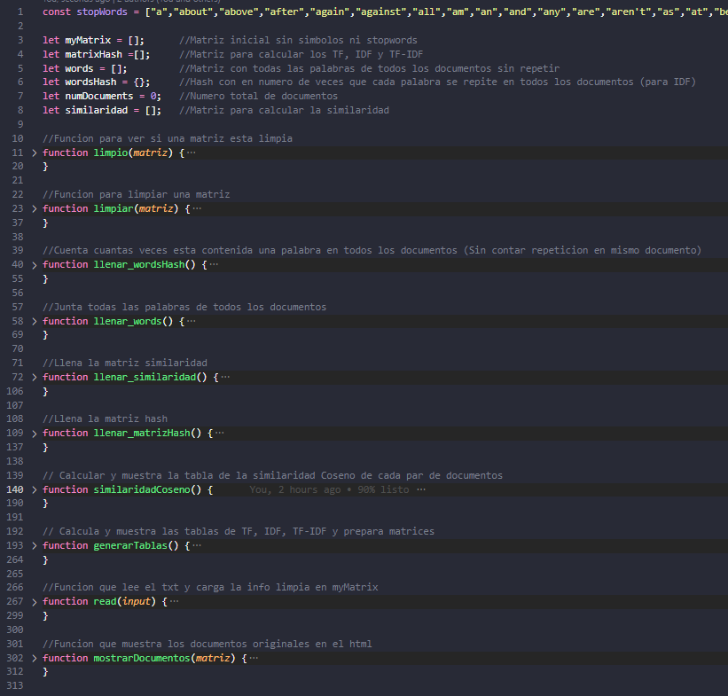
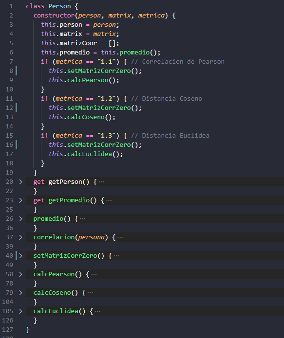

# GESTIÓN DEL CONOCIMIENTO EN LAS ORGANIZACIONES
## Sistemas de recomendación
#### José Daniel Fuentes Marra - alu0101166247@ull.edu.es

### **[Link para probar la web online](https://alu0101166247.github.io/GCO-Sistema-de-recomendacion/)**

Este proyecto está desarrollado en Javascript y HTML, en el index.html se encuentra el código en html de la página web donde se puede interactuar con el proyecto:

Básicamente tenemos dos apartados, el de la izquierda es donde se especifica el tipo de métrica, el tipo de predicción, el número de vecinos considerados y donde cargaremos la matriz en formato txt y visualizarla.

En el apartado de la derecha tenemos un botón "Predecir" el cual ejecuta toda la lógica y muestra lo mostrado en la imagen. El botón "Predecir" se desactiva al calcular una matriz y para volver a calcular con otra matriz o con otros parámetros en las opciones tenemos que usar el botón "Recargar" y volver a especificar lo deseado.

Siguiendo con la estructura del proyecto tenemos 4 directorios, en "css" encontramos las hojas de estilos para el html, en "images" se encuentran las imágenes usadas en el html y en el README, en "Matrices" encontramos la matriz de ejemplo de las transparencias de clases y las matrices de ejemplo del Github compartido por el profesor y por ultimo en "js" encontramos el código en Javascript con la lógica del proyecto.

Para explicar un poco las funciones y lógica implementada tenemos la siguiente imagen donde podemos ver los diferentes métodos implementados:

Para empezar, hay 3 variables globales, "myMatrix" almacena la matriz cargada para ser usada en todos los métodos, "currentPerson" es un objeto de la clase "Person" y "out" va almacenando todas las salidas durante el proceso de cálculo de cada apartado para ser mostradas al final en la página.

La clase "Person":

Fue creada para calcular todo lo necesario de la persona que estemos analizando en ese momento, se recorre la matriz original en busca de "-" y al encontrarlo se crea un objeto de esta clase que recibe como parámetro la posición de esa persona en la matriz "person", la matriz entera "matrix" y "metrica" que especifica el tipo de métrica que tiene que calcular con las demás personas.

Contiene métodos get que son para poder acceder a valores que sean necesitados fuera de la clase y los métodos que contiene son: "promedio" que calcula el promedio de la persona que está siendo analizada, "correlacion(persona)" que devuelve la correlación que tiene la persona analizada respecto a otra persona que se le pase a la función, "setMatrizCorrZero" simplemente hace una copia de la matriz original con puros ceros para luego con los métodos "calcPearson", "calcCoseno" y "calcEuclidea" se hacen las fórmulas necesarias con todos los vecinos y se almacena en "matrizCorr" todos los resultados de las similaridades.

Para terminar, los métodos que se encuentran fuera de la clase: 

El método "read" se encarga de leer el txt y rellenar "myMatrix", el método "mostrarMatrizOri" simplemente muestra la matriz original en el lado izquierdo de la interfaz, el método "predecir" es el principal donde según los parámetros que se hayan especificado se crea el objeto "Person" y se calculan las fórmulas necesarias y se muestra la salida, el método "guiones" analiza la matriz original en cada iteración en busca de "-" para ser resueltos, la función "vecinosProximos" devuelve los vecinos a utilizar según el número de vecinos especificado y el resultado obtenido de similaridades en la clase y por último el método "promedioPersona" calcula el promedio de sus puntuaciones en la matriz original.

